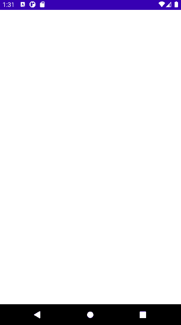

## Funcionalidades do projeto

O App lista notas com imagem, título e descrição, sejam armazenadas internamente ou recebidas via web API.

### 

> Na demonstração, as notas carregadas são fornecidas a partir de uma web API. Essa API foi 

As técnicas e tecnologias utilizadas pra isso são:

- Navigation: configuração da navegação das telas
- RecyclerView: listagem das notas
- ConstraintLayout: ViewGroup para implementar o layout das notas
- Coil: carregar imagens via requisição HTTP
- Retrofit: requisição HTTP para buscar novas notas
- Room: Armazenamento interno das notas
- ViewModel: modelo para manter regra de negócio das Activities/Fragments
- Coroutines: processamento assíncrono
- View Binding: busca de views do layout de forma segura